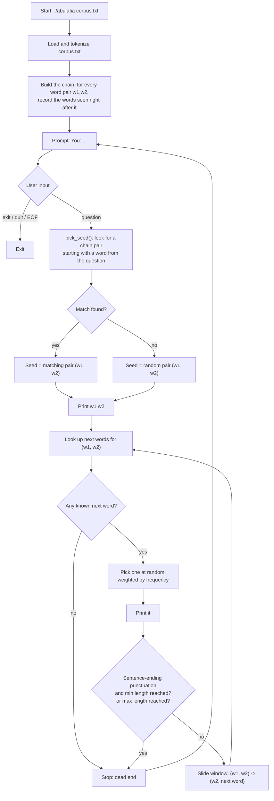

# Abulafia: a Markov-Chain text generator

A small C program that reads a `.txt` file, builds a Markov chain from it, and uses that chain to answer questions typed interactively by the user with generated, plausible-sounding sentences.


## What it does

You give Abulafia a text file (a book, a collection of articles, any reasonably-sized body of text). It learns which words tend to follow which others in that text. Then, in a chat-like loop, you type a question and Abulafia replies with a sentence generated by walking through the learned word transitions, loosely "anchored" to a word from your question.

The output is not real natural-language understanding - it's a statistical mimicry of the input text's style. With a small corpus, answers will look very close to verbatim excerpts (few alternatives exist at each step); with a large, varied corpus, the generated sentences become much more novel.


## How it works




## Building

Requires a C compiler (`gcc` by default) and `make`.

```bash
make
```

This produces an `abulafia` executable. To remove it:

```bash
make clean
```


## Usage

```bash
./abulafia corpus.txt
```

or, via the Makefile (uses `corpus.txt` by default, override with `FILE=`):

```bash
make run FILE=corpus.txt
```

Once started, the program prints how many words and word-pairs it learned, then prompts for input:

```
Markov chain ready (1532 words, 1140 unique pairs).
Ask a question (type 'exit' to quit):

You: where does the cat live?
> the black cat sleeps on the roof of the house near the garden.

You: exit
```

Type `exit` or `quit` (or send EOF, e.g. Ctrl-D) to leave.


## Test corpus

[`moby.txt`](https://github.com/matteogiorgi/abulafia/blob/main/moby.txt) is the full text of *Moby-Dick; or, The Whale* by Herman Melville, downloaded from [Project Gutenberg](https://en.wikipedia.org/wiki/Project_Gutenberg) (public domain) and kept in the repo as a ready-to-use, sufficiently large corpus for trying out and demoing the chain (~216k words, ~1.2 MB). A small input produces answers that closely echo the source almost verbatim, since few alternative continuations exist at each step; a corpus this size gives the chain enough alternatives per word pair to produce noticeably more varied, novel-sounding sentences.

Try it with:

```bash
make run FILE=moby.txt
```


## Implementation details

The whole program lives in a single file, [abulafia.c](https://github.com/matteogiorgi/abulafia/blob/main/abulafia.c).

- **Tokenization.** The input file is split on whitespace only (`fscanf(f, "%s", ...)`). Punctuation stays attached to the word it follows (e.g. `"casa."` is one token), which is a cheap way to later detect sentence boundaries without a separate parsing pass.

- **Markov chain, order 2.** The chain's key is a *pair* of consecutive words `(w1, w2)`, mapped to the list of words observed to follow that pair anywhere in the source text. A word that follows a given pair more often is stored multiple times in that list, so picking a random entry from it naturally reproduces the original transition frequencies (higher-probability continuations are more likely to be picked).

- **Storage.** Pairs are kept in a fixed-size hash table (`HASH_SIZE` buckets) with separate chaining, using the djb2 string hash combined for both words. A flat array of every distinct pair (`all_entries`) is kept alongside the table so the program can pick a uniformly random pair without walking the whole table.

- **Answering a question.** `pick_seed()` splits the question into words and looks for one that matches the first word of some known pair in the chain (case-insensitive, punctuation-stripped comparison); if several match, one is chosen at random, which loosely ties the reply to the question's topic. If no word matches anything in the chain, a uniformly random pair is used instead, so the program always produces some output.

- **Generation.** Starting from the seed pair, `generate_answer()` repeatedly looks up the current pair's list of possible next words, picks one at random, prints it, and slides the pair forward by one word (`w1, w2 -> w2, next`). Generation stops when: the current pair has no recorded continuation (a "dead end" in the chain), a word ending in `.`, `?` or `!` is produced (once at least `GEN_MIN_WORDS` words have been emitted), or `GEN_MAX_WORDS` is reached as a safety cap.

- **Memory.** The program allocates freely (`strdup`, growable arrays) and never frees, relying on process exit to reclaim memory - reasonable for a short-lived interactive CLI tool.


## TODO / possible improvements

- [ ] Configurable chain order (currently fixed at 2) via a CLI flag.
- [ ] Smarter tokenization: split punctuation into its own tokens instead of gluing it to words, and normalize quotes/dashes.
- [ ] Preserve original capitalization more faithfully in the output instead of only comparing case-insensitively.
- [ ] Avoid regurgitating long verbatim runs from the source text (e.g. cap how many consecutive steps can follow the single most likely path, or favor less-traveled transitions).
- [ ] Support loading multiple input files to build a combined chain.
- [ ] Save/load a previously built chain to/from disk, to skip re-parsing large corpora on every run.
- [ ] Proper Unicode-aware tokenization/case-folding (currently relies on `<ctype.h>`, which is locale- and byte-oriented, not UTF-8 aware).
- [ ] Replace the linear scan over `all_entries` in `pick_seed()` with a direct hash lookup keyed by first word, for better performance on large corpora.
- [ ] Free allocated memory on exit (mainly relevant if the program were turned into a long-running service instead of a one-shot CLI).
- [ ] Basic automated tests (e.g. feed a small fixed corpus and check that generated output only ever uses known transitions).
